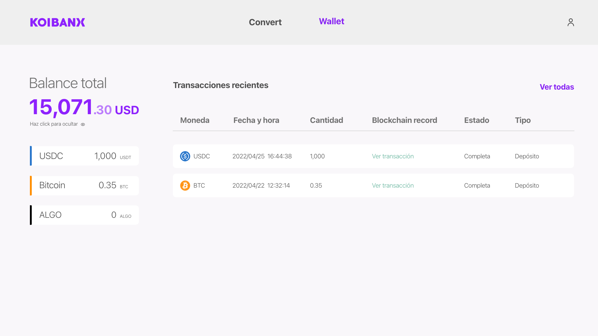
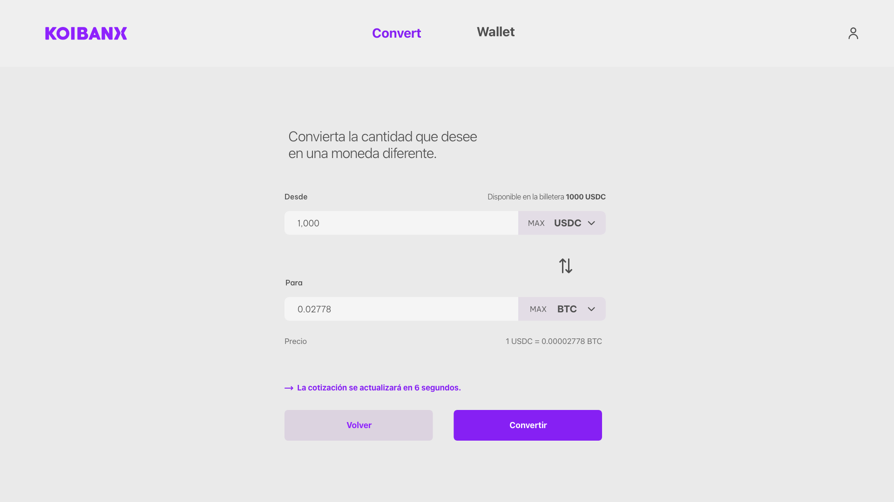

# Koibanx exchange challenge

Se deberá crear un exchange que nos permita ver nuestros activos, nuestros últimos movimientos y poder intercambiar entre los distintos activos.

El equipo de diseño estuvo trabajando en los diferentes layouts para que nos sea más fácil el desarrollo.

Un compañero de equipo ha empezado el proyecto y nos ha dejado una base inicial lista. Esto incluye la barra de navegación y el ruteo.

El equipo de backend no ha realizado la API pero nos ha dejado lista la interfaz con la que nos tenemos que comunicar. Por el momento no se requiere ningún tipo de seguridad ni autenticación. Debajo encontrarás la documentación.

Todo el código de la aplicación puede ser modificado. Los assets se encuentran en la carpeta src/assets dentro del proyecto.

No es necesario que el layout sea responsive.

En el root del repositorio se encuentra un archivo que se llama swagger.yaml que contiene la especificación de la API. Puedes visualizarlo importandolo en https://editor.swagger.io

## Definición funcional

El proyecto consta de dos pantallas, a continuación se define la funcionalidad de cada una y cómo deben visualizarse.

### Wallet

- El balance total es la suma de todos los activos que tiene el usuario en USD. Este debe actualizarse cada 15 segundos. Es obtenido haciendo una llamada a la API.
- El balance debe poder ocultarse clickeando el ojo. Si se refresca la página debe mantenerse como estaba.
- Nuestro exchange soporta 3 activos: USDC, ALGO y BTC.
- También deben mostrarse las últimas 5 transacciones. El botón Ver todas no debe ser implementado.

### Convert 

En esta pantalla podremos intercambiar los activos que tenemos en nuestra wallet por alguno de los otros.

- Los activos que permite intercambiar el exchange son USDC, ALGO y BTC.
- Debe mostrarse el saldo disponible de la moneda que tenemos seleccionada en el campo ‘Desde’ para que nuestro cliente sepa hasta cuanto puede ingresar.
- El botón ‘Max’ completa el input con el máximo saldo disponible de la persona.
- Si el saldo es insuficiente debería mostrarse un error.
- El precio de la conversión dura 15 segundos. Una vez finalizado hay que volver a pedir el precio del rate.

## Bonus
Se sumará puntos extra por cada ítem cumplido de los siguientes:
- Tests unitarios con Jest y React Testing Library

## Modalidad de entrega
- Repositorio público subido a GitHub o Gitlab.
- Link a la aplicación funcionando.

Enviar mail con ambos links a challenges@koibanx.com

## Consultas
Por dudas o consultas, escribir a challenge@koibanx.com
